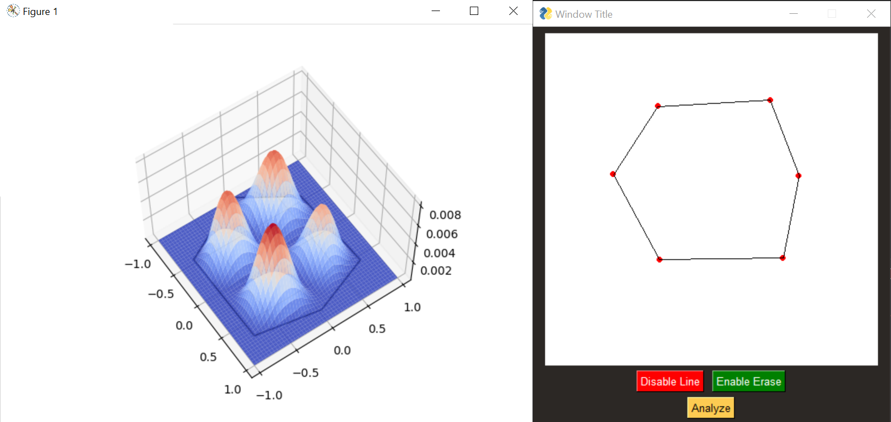

Approximating the 2D particle in a box problem for generalized boundaries. Approximates the wavefunction using a basis of "little sinc functions" to simplify problem into a matrix eigenvalue problem. Could easily be extended into N dimensions. Will add more features later.

Implementation of this paper: https://arxiv.org/pdf/0801.4291.pdf

